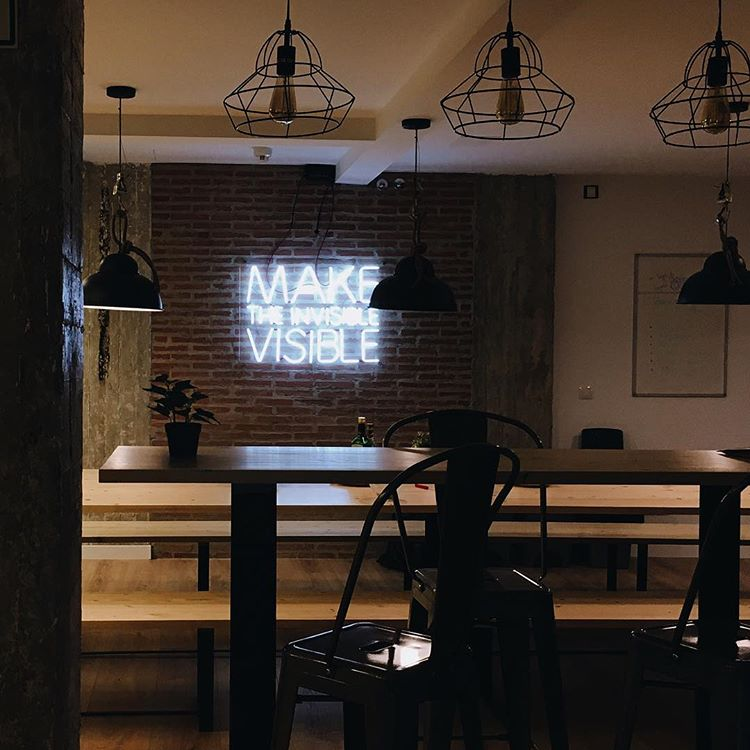

I love rap music since I was a kid. Back in the day, in Spain we only had access to the mainstream rap. My first memories are MC Hammer and Vanilla Ice. I was hooked to that sound at first listening. Then, Kris Kross came out and I bought my first vinyl. And then, it became easier to buy some imported records and Pete Rock & CL Smooth, Wu Tang Clan and Snoop Dogg entered my life.

Lucky for me, I was born in a city that would become a cornerstone in spanish rap: Zaragoza. I didn't know at the time but there were a flourishing Hip Hop scene in my hometown. As soon as I stumble upon it, I decided that I'd learn how to make rap music, both rhyming and producing.

Since that day, I've been a rap nerd. As I was trying to learn and improve my MC skills, I started to recognize patterns. Why some rappers sounded better than others, what their tricks were. The key is the structures that they built with phonemes, combining words. The day came where I was visualizing those structures in real time in my head.

Twenty years forward. I discover a video on Youtube called [Rapping, deconstructed](https://www.youtube.com/watch?v=QWveXdj6oZU) that captured exactly what we emcees saw in our brains. With a simple color coding, it was easy for everybody to grasp the complexity that is hidden in apparently simple songs. Rap is usually downgraded, like if it was something easy to write. It is not. And definitely this video showed it in an awesome way.

I work at CARTO, where our motto is *Make the invisible visible*. We use visualizations to bring insights to the surface that were hidden in data. Every month we hold a CARTOchat. It's a talk where someone shares an interesting topic with us. So I coded an app to show these sound structures in five spanish rap songs in one of these talks.

I coded the first version using [Svelte](https://svelte.technology/) (impressive library) to get quick feedback on how hard it would be to sync annotated text with music. It was feasible. I ended up using React so I could practice a bit more with it. I captured the result in video to share it on Youtube. I don't share the code because I had to rush to get it done and took lots of shortcuts. Quite far from clean code.

[Here you can find the playlist](https://www.youtube.com/watch?v=x7_y7wcDecM&list=PLW6By36V3G9HcBelksbIeXsF0AGyuv2mK). It starts with the first hit in spanish rap history, that uses the most simple structure possible. Using it as a starting point, every song after it gets more complex.

As an example, take this fragment from Xtragos. He's my partner in crime in the rap group Grossomodo. Almost all syllables compound to paint all verses in colors.

`youtube:https://www.youtube.com/embed/7K6dyJGk07I`

The bad news are that I was so worried on nailing the talk that I didn't press the Rec button. I don't know if I will do it again but it that happens, I'll press the right button. Fo shizzle.

[Picture](https://www.instagram.com/p/BCQxSQ_kmL6/) by Ariana Escobar
